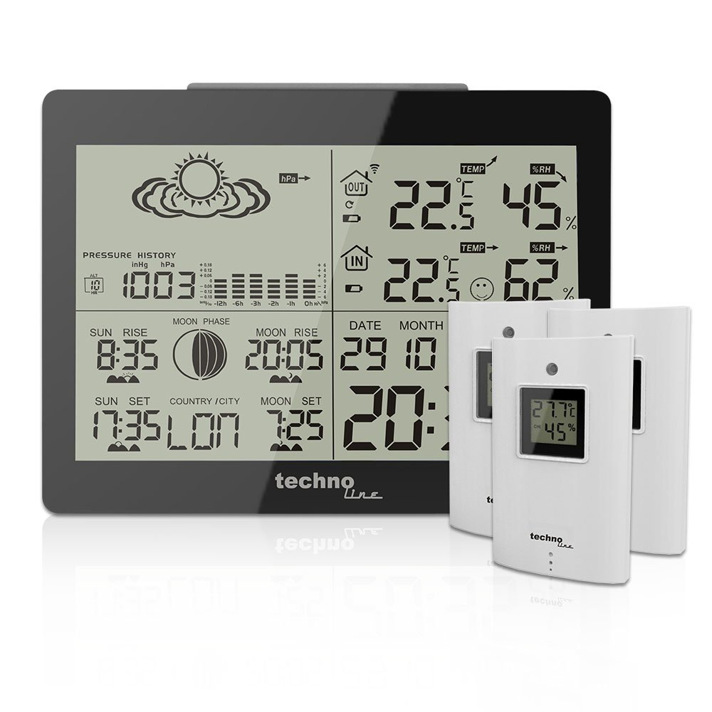

# Arduino Nexus

Radio Nexus protocol library Arduino for sending temperature and humidity from DIY sensors to weather stations.

## What does it do

This library takes a given temperature and humidity, encode them using the Nexus protocol and send them through a 433Mhz transmiter.

## What do you needed

- An avr or esp8266 board
- A sensor, any DHT or a bmp280
- A 433Mhz transmitter
- A weather station that supports the Nexus protocol, like this one[one](https://www.amazon.es/GARNI-WS-6760-estaci%C3%B3n-metereol%C3%B3gica/dp/B00PLNQ8KW) :

## Download and install

Lastest release: v0.1.0

1. Download latest release
2. Extract it to the **libraries** folder inside your Sketchbook. Default is **[user]\Arduino\libraries**.
3. Restart Arduino IDE if you had it open.
4. Done

## The Nexus protocol

*The description of the protocol was obtained from [nexus433](https://github.com/aquaticus/nexus433), a program for receiving info encoded using the Nexus Protocol, but the original description was missing a trailing `0`.*

A device sends every minute or so (Sencor every 58 seconds, Digoo every 80 seconds) 12 data frames.

Each data frame consists of 37 bits. There is no checksum.

The meaning of bits:

| Bits    | 8  | 1       | 1 | 2       | 12          | 4    | 8        | 1 |
|---------|----|---------|---|---------|-------------|------|----------|---|
| Meaning | ID | Battery | 0 | Channel | Temperature | 1111 | Humidity | 0 |

1. *ID* &ndash; unique ID; Sencor generates new ID when the battery is changed, Digoo keeps the same ID all the time.
2. *Battery* &ndash; low battery indicator; 1 &ndash; battery ok, 0 &ndash; low battery
3. *Channel* &ndash; channel number, 0 &ndash; first channel, 1 &ndash; second and so on.
4. *Temperature* &ndash; signed temperature in Celsius degrees.
5. *Humidity* &ndash; humidity

Every bit starts with 500 µs high pulse. The length of the following low
state decides if this is `1` (2000 µs) or `0` (1000 µs).
There is a 4000 µs long low state period before every 37 bits.

## How to use

For sending temperature and humidity data to your weather station you will need to know the channel and id the other sensor is using, or set a pair. Once you know them you create and `Arduinonexus` object:

	nexus = Arduinonexus(10, 2, 14, 1);
	
Where the parameters are: `Pin` where the transmitter is connected to, the `channel` used to send the data, the `id` and `battery` status. now you can send temperature and humidity data:

	nexus.send(12.3, 25)
	
Once the sensor is sending data you can pair it with the weather station. For more info look the examples.